\newpage
# Práctica 1: LED AC Rectificador

## Introducción

Mediante tres diferentes arreglos de circuitos, se encenderá un LED mediante una fuente de tipo alterna desde una clavija a la toma de corrientes de 120v. A continuación, se presentará el procedimiento y resultados de la práctica.

## Objetivo

- Encender un LED mediante corriente alterna.

## Marco teórico

### Diodos

El diodo es un dispositivo tipo semiconductor que permite el paso de la corriente eléctrica en un sentido cuando se le administra un voltaje suficiente para dejar que fluya la corriente, e impide su paso a través del otro sentido, el cual usualmente se aplica para rectificar el flujo de la corriente por sus características. Es un componente básico de los circuitos electrónicos que esta muy presente en dispositivos modernos, tales como ordenadores, equipos de audio, televisores, teléfonos, entre otras cosas. De igual manera, su principal aplicación, ya antes mencionado, es como rectificador, ya que permite el cambio de corriente alterna a directa mediante un arreglo conocido como puente de diodos, debido a que cuentan con polaridad, donde estan presentes el cátodo (terminal negativa) y el ánodo (terminal positiva). Los diodos se clasifican según su tipo, tensión y capacidad de corriente.

Imagen de un diodo (pendiente)

Cuando un diodo permite un flujo de corriente, tiene polarización directa. Cuando un diodo tienen polarización inversa, actúa como un aislante y no permite que fluya la corriente.

Imagen del funcionamiento de un diodo.

### Diodo emisor de luz (LED)

Existen varios tipos de diodos con diferentes aplicaciones y utilidades según su configuración y estructura, uno de éstos es el diodo tipo LED, los cuales funcionan en polarización directa, y se caracterizan porque las recombinaciones de los portadores de carga generan fotones, las particulas elementales que forman la luz. Dentro de estos hay de varios tipos, como los DIP (Dual In-Line Package) LED, que son las luces LED tradicionales y en las que piensa la mayoría de la gente cuando se les pide.

### Voltaje 127 AC
Existen múltiples formas de alimentación eléctrica, la más utilizada de manera cotidiana es mediante el voltaje de 127 volts con el que la mayoría contamos en nuestros hogares. Este voltaje se conoce como voltaje nominal y está regulado por el "Reglamento de la Ley del Servicio Público de Energía Eléctrica". Durante esta práctica se utilizará dicho voltaje como forma de alimentación del circuito que se utilizará para analizar el comportamiento de la corriente en dos situaciones.

### Resistencia
Estos componentes están hechos de carbón u otros materiales que se oponen al flujo de corriente, lo cual genera una característica eléctrica llamada "resistencia". Esta característica se define como la oposición al flujo de electrones a través de un conductor.

### Rectificador de media onda
De manera general es un circuito simple empleado para eliminar la mitad de una onda, ya sea la parte positiva o la negativa. Para realizar uno de estos rectificadores basta con colocar un diodo en el circuito. También existen los rectificadores de onda completa cuya construcción es ligeramente más compleja, donde se requieren 4 diodos en un arreglo específico.

## Materiales
A continuación se presenta la lista de los componentes utilizados en ambos casos de la práctica:

|     Componente    | Cantidad |
|:-----------------:|:--------:|
| Cable cal. 22     | 2m       |
| Clavija con cable | 1        |
| LED               | 1        |
| Diodo 1N4007      | 1        |
| Resistencia 30K   | 1        |

## Esquemático
A continuación se muestran los dos circuitos que se realizaron, sólo se agregó un diodo en el segundo circuito.  Este cambio resultó en una gran diferencia que se abordará a profundidad en los resultados.

### Circuito sin rectificador

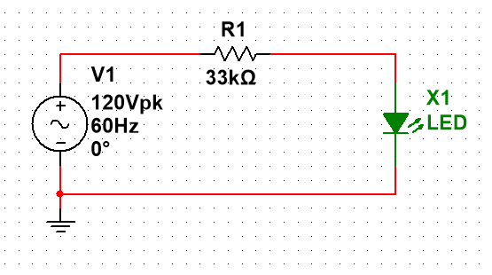

### Circuito con rectificador de media onda

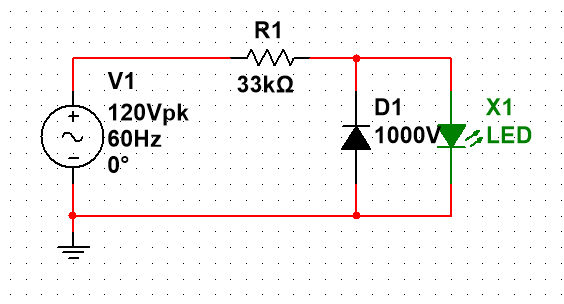

## Resultados y Conclusiones

Se pudo observar mediante la creación del circuito la forma en la que la corriente varía cuando se tiene y cuando no se tiene un diodo rectificador. Debido a la simpleza, se optó por realizar las simulaciones para poder observar el comportamiento de la corriente en ambas situaciones. En la primera se puede observar que el LED recibe tanto la parte negativa como la positiva de la corriente. Cabe recalcar que este dispositivo es un diodo, por ello no se recomienda que absorba el ciclo negativo a través del cátodo, ya que puede disminuir la vida útil del componente. En la siguiente imagen se puede observar que el LED recibe ambas partes de la onda.

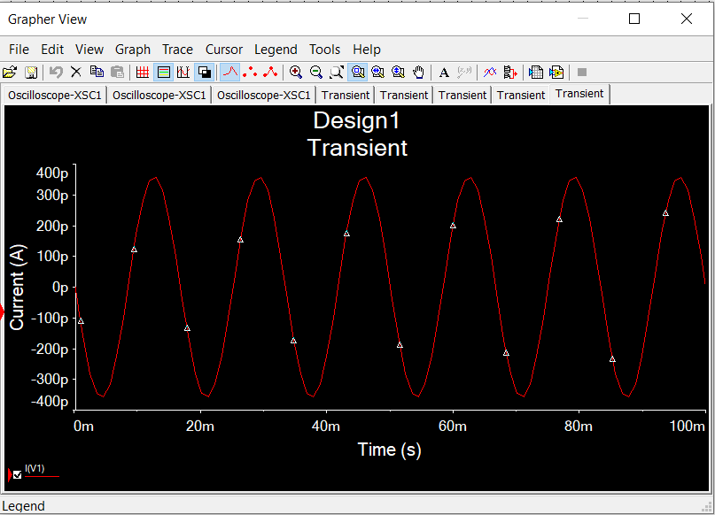

En cambio, al colocar el diodo el LED únicamente recibe la corriente que permite pasar y el lado negativo pasa a través del diodo en paralelo. De esta manera la corriente en el LED se comporta de la manera que se muestra a continuación.

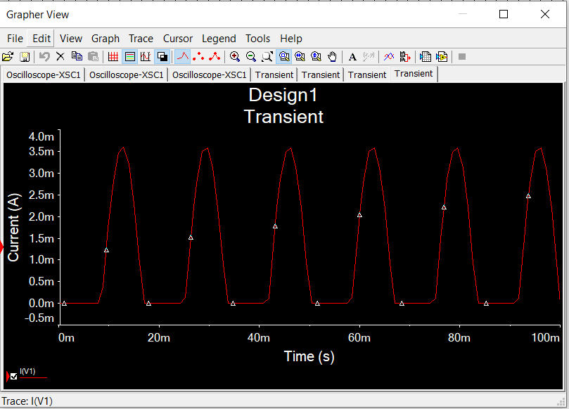

Es de suma importancia conocer el funcionamiento interno de los componentes para realizar el diseño de un circuito. Esto nos permite una mejor comprensión en caso de tener errores o que algo no funcione como se espera. Esta práctica sentó las bases de la interacción de la corriente con los diodos, nos permitió observar de manera gráfica cómo funcionan y la utilidad que presentan en un caso aplicativo.
\newpage

# Práctica 2: Silicon Controlled Rectifier (SCR)

## Introducción

Mediante dos arreglos distintos, se controlará una fuente de iluminación mediante el uso de un SCR.

## Objetivo

Se demostrará el funcionamiento básico de un dispositivo SCR por medio del encendido de un foco que se alimenta a 12V, asi como se evaluará las condiciones para su conducción entre terminales mediante dos botones, uno para encalavar el flujo de corriente y el foco permanezca encendido, y otro como botón de paro, el cual cesará el flujo de corriente y apagará el foco.

## Marco teórico

### Rectificador Controlado de Silicio (SCR)

El dispositivo fué presentado por primera vez en 1956 por Bell Telephone Laboratories. Algunas de las áreas más comunes de aplicación de los SCR incluyen controles de relevador, circuitos de retardo de tiempo, fuentes de potencias reguladas, interruptores estáticos, controles de motor, inversores, cicloconvertidores, cargadores de batería, controles de fase, entre otros dispositivos.

En la actualidad, los dispositivos SCR han sido diseñados para controlar potencias tan altas como 10MW con valores nominales individuales hasta de 2000A a 1800V. Su intervalo de frecuencia de amplificación tambien se ha ampliado hasta 50kHz, lo que ha permitido algunas aplicaciones como calefacción por inducción y limpieza ultrasónica.

El símbolo gráfico del SCR se puede apreciar a continuación:

---------------- INSERTE IMAGEN DE SIMBOLO SCR --------------------

## Materiales

|     Componente          | Cantidad |
|:-----------------------:|:--------:|
| Cable cal. 22           | 2m       |
| Clavija con cable       | 1        |
| Puente de diodos        | 1        |
| Capacitor 470uF a 25V   | 1        |
| Transformador de 12V    | 1        |
| Botones de pulso        | 2        |
| SCR mod. C10GB a 4A     | 1        |
| Foco de 12V             | 1        |
| Resistencia 100kohm     | 1        |

## Esquemático

IMAGEN DE CIAU

## Resultados

\newpage
# Práctica 3: On Delay 120V

## Introducción

Esta práctica trata sobre la utilización de un LM555 para poder crear un timer on delay con un valor de retardo de 10 segundos para, seguidamente, probar su funcionalidad en un circuito más grande con un foco como información visual.

## Objetivo

- Creación de un timer on delay que pueda funcionar con 120V AC.
- Utilizar el timer on delay previamente creado como un módulo en un circuito combinado con un enclavamiento para mantener encendido un foco.

## Marco teórico

### LM555

El circuito integrado 555 es un temporizador eléctrico y se le conoce como “máquina del tiempo” por la gran variedad de tareas que puede realizar con respecto al tiempo. El LM555 tiene internamente una combinación de circuitos digitales y analógicos, se utiliza comúnmente para proporcionar retardos de tiempo, como oscilador a una determinada frecuencia, y como un circuito integrado flip-flop.

Los empaquetados de los circuitos integrados se pueden identificar por una o varias letras como D, DB, JG, P o PW el cual es el más común para experimentación y tiene 8 pines en total (\cref{conexiones-lm555}).

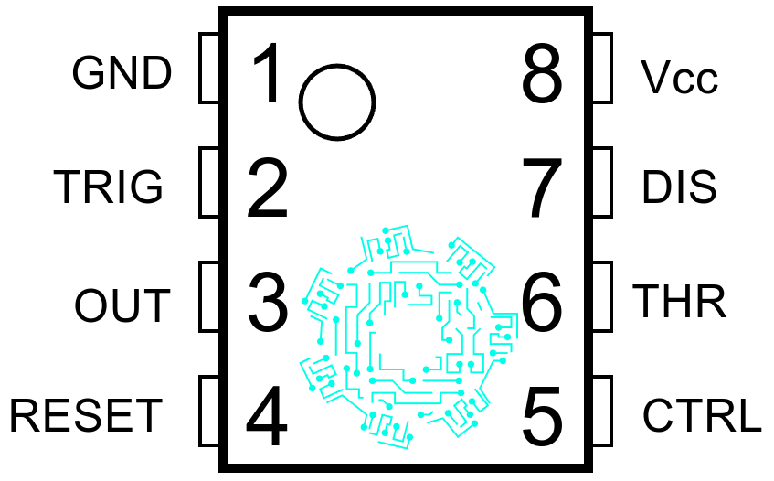{width=25%}

1. **GND:** Corresponde a la terminal negativa de la alimentación, generalmente tierra.

2. **Disparo(TRIG):** Es la parte del circuito integrado donde se establece el inicio del tiempo de retardo para la configuración monoestable del LM555. Para que ocurra este proceso el pulso disparador disminuye el voltaje (1/3)Vcc, donde Vcc corresponde al voltaje de alimentación.

3. **Salida(OUT):** En este pin se puede observar el resultado de la configuración del temporizador eléctrico ya sea como monoestable, estable u otra opción.

4. **Reinicio(RESET):** Para un nivel de voltaje por debajo de 0.7 V, tiene la función de poner el pin de salida a nivel bajo. Para evitar el reinicio se deberá conectar este pin a alimentación.

5. **Control de voltaje(CTRL o CONT):** Al utilizar el circuito integrado LM555 como controlador de voltaje, el voltaje en esta terminal puede variar teóricamente desde Vcc hasta aproximadamente 0 V, en la práctica la variación es de Vcc – 1.7 V hasta casi 2 V menos.

6. **Umbral(THR o THRES):** Corresponde a la entrada de un comparador interno de umbral el cual se emplea para poner la señal de salida a un nivel bajo.

7. **Descarga(DIS o DISCH):** Permite descargar el condensador externo al circuito integrado 555 para su funcionamiento.

8. **Voltaje de alimentación(Vcc o Vdd):** Terminal positiva de la alimentación, normalmente son valores de 4.5 V hasta 16 V.

### Timer on delay

Como su nombre lo indica, el timer on delay no genera una salida hasta que transcurre un tiempo predefinido:

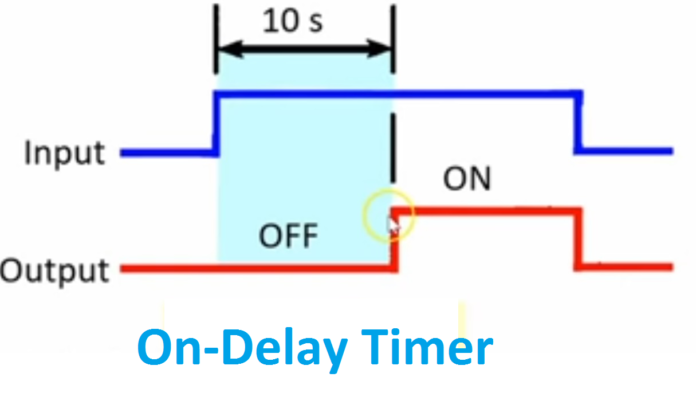{width=50%}

Como se puede observar en la \cref{funcionamiento-on-delay}, cuando se energiza el timer, este no genera una salida alta hasta que pasa, en el caso de este ejemplo, un periodo de tiempo de 10 segundos. Este tiempo es el que puede ser modificado, dependiendo de la aplicación que se le de.

## Materiales

- 1 BC337
- 1 LM555
- 1 contactor
- 1 foco
- 1 relay 12V
- 1 switch nc
- 1 switch no
- Capacitores 103
- Resistencias 10K
- Resistencias 2.2K

## Esquemático

{width=25%}

{width=25%}

{width=25%}

## Resultados

En el inciso a, se logró utilizar el LM555 en su modo monoestable. Esto quiere decir que, combinado con un push button, se logró simular el funcionamiento de un on delay, a pesar de que, en realidad, no lo sea por definición.

En el inciso b, se utiliza el LM555 en el modo de retardo de tiempo, específicamente, después de ser energizado, con un valor de 10 segundos. Esto quiere decir que se logra crear un timer on delay con un valor de retardo a la entrada de 10 segundos. Después de probarlo, se obtienen resultados satisfactorios.

En el inciso c, ya con el timer on delay armado del punto anterior, se utiliza como un módulo para un circuito más grande. Este nuevo circuit cuenta con el timer y un contactor, conectado de manera que se tenga un enclavamiento. Esto logra que, una vez pasado el tiempo de retardo del timer, el foco se activa y, al mismo tiempo, se activa el enclavamiento, manteniendo encendido el foco, siempre y cuando no se desenclave por medio del butón normalmente cerrado.

\newpage
# Práctica 4: Enclavamiento Electromagnético

## Introducción

La presente práctica trata acerca de encender una carga mediante un interruptor (Contacto NC) y mantenerla energizada a través de un enclavamiento electromagnético, esto al conectar en paralelo un contacto auxiliar con el interruptor antes mencionado.

## Objetivo

- Encender un motor a través de un interruptor (NC) y cortar la energía a través de un interruptor normalmente abierto.

## Marco teórico

### Enclavamiento
Consiste en conectar en paralelo un contacto auxiliar (NA) con un interruptor (NC).

### Contactor
Un contactor es un elemento electromecánico que tiene la capacidad de establecer o interrumpir la corriente eléctrica de una carga, con la posibilidad de ser accionado a distancia mediante la utilización de elementos de comando, los cuales están compuesto por un circuito bobina / electroimán por la cual circula una menor corriente que la de carga en sí (incluso podría utilizarse baja tensión para el comando). Constructivamente son similares a los relés, y ambos permiten controlar en forma manual o automática, ya sea localmente o a distancia toda clase de circuitos. Pero se diferencian por la misión que cumple cada uno: los relés controlan corrientes de bajo valor como las de circuitos de alarmas visuales o sonoras, alimentación de contactores, etc. y los contactores se utilizan como interruptores electromagnéticos en la conexión y desconexión de circuitos de iluminación y fuerza motriz de elevada tensión y potencia.

## Materiales

### Inciso a)

|     Componente          | Cantidad |
|:-----------------------:|:--------:|
| Cable cal. 22           | 2m       |
| Clavija con cable       | 1        |
| Fusible 10A             | 1        |
| Contacto NA             | 1        |
| Contacto NC             | 1        |
| Transformador 24V       | 1        |
| Contactor               | 1        |
| Motor DC                | 1        |
| ITM                     | 1        |
| Fusible 10A             | 1        |

### Inciso b)

|     Componente          | Cantidad |
|:-----------------------:|:--------:|
| Puente de diodos        | 1        |
| Clavija con cable       | 1        |
| Puente de diodos        | 1        |
| Capacitores 105         | 2        |
| Cap. Electrol 100mF 35V | 1        |
| Contacto NA             | 1        |
| Contacto NC             | 1        |
| Motor de ventilador     | 1        |
| Contactor               | 1        |
| ITM                     | 1        |
| Fusible 10A             | 1        |

### Inciso c)

|     Componente          | Cantidad |
|:-----------------------:|:--------:|
| Cable cal. 22           | 2m       |
| Clavija con cable       | 1        |
| Puente de diodos        | 1        |
| Cap. elect. 100mF 35V   | 1        |
| Contacto NA             | 1        |
| Contacto NC             | 1        |
| Capacitor 105           | 2        |
| Contactor               | 1        |
| ITM                     | 1        |
| Fusible 10A             | 1        |

## Esquemático

## Resultados

\newpage
# Práctica 5: Arranque, Reversa y Paro con Motor Monofásico

## Introducción

Esta práctica consta de la combinación de dos partes: primero, se tiene un circuito de lógica, conformado por el CD4001, que se encarga de controlar el inicio, paro y sentido de giro del motor monofásico, en combinación con un arreglo que permite enclavar la señar.

Seguidamente, este circuito se conecta a uno de potencia, que utiliza la lógica anterior junto con un contactor para poder cambiar el sentido de dirección del motor, dependiendo de los botones que hayan sido presionados con anterioridad.

## Objetivo

- Implementación de un arranque y paro, con enclavamiento, por medio de compuertas NOR
- Utilización del arraqnue y paro junto con un un circuito de potencia para controler el sentido del giro de un motor monofásico

## Marco teórico

### MAC223

El triac es un dispositivo semiconductor de tres terminales que se usa para controlar el flujo de corriente promedio a una carga, con la particularidad de que conduce en ambos sentidos y puede ser bloqueado por inversión de la tensión o al disminuir la corriente por debajo del valor de mantenimiento. El triac puede ser disparado independientemente de la polarización de puerta, es decir, mediante una corriente de puerta positiva o negativa.

Cuando el triac conduce, hay una trayectoria de flujo de corriente de muy baja resistencia de una terminal a la otra, dependiendo la dirección de flujo de la polaridad del voltaje externo aplicado.

El MAC223A8 (\cref{mac223}) es un TRIAC estándar de 25 A diseñado para aplicaciones de conmutación de CA y control de fase. Este normalmente funciona en los cuadrantes I y III activados desde la línea de CA.

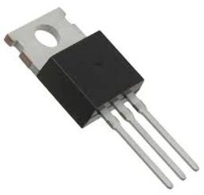{width=15%}

### MOC3011

Este (\cref{moc3011}) consta de un diodo emisor de infrarrojos de arseniuro de galio, acoplado ópticamente a un interruptor bilateral de silicio y está diseñado para aplicaciones que requieren disparo aislado de TRIAC,  bajo corriente de conmutación aislado de CA, un alto aislamiento eléctrico (a 7500V pico), de alto voltaje detector de punto muerto, pequeña tamaño, y de bajo costo.

Un opto acoplador, también llamado optoaislador o aislador acoplado ópticamente, es un dispositivo de emisión y recepción que funciona como un interruptor activado mediante la luz emitida por un diodo LED que satura un componente opto electrónico, normalmente en forma de fototransistor o fototriac. De este modo se combinan en un solo dispositivo semiconductor, un foto emisor y un foto receptora cuya conexión entre ambos es óptica. Estos elementos se encuentran dentro de un encapsulado que por lo general es del tipo DIP. Se suelen utilizar para aislar eléctricamente a dispositivos muy sensibles.

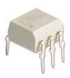{width=15%}

### CD4001

Es un circuito integrado que consta de cuatro compuertas NOR de dos entradas (\cref{cd4001}). La puerta NOR o compuerta NOR es una puerta lógica digital que implementa la disyunción lógica negada, se comporta de acuerdo a la tabla de verdad. Cuando todas sus entradas están en 0 (cero) o en BAJA, su salida está en 1 o en ALTA, mientras que cuando una sola de sus entradas o ambas están en 1 o en ALTA, su SALIDA va a estar en 0 o en BAJA. NOR es el resultado de la negación del operador OR. También puede ser visto como una puerta AND con todas las entradas invertidas. El NOR es una operación completamente funcional. Las puertas NOR se pueden combinar para generar cualquier otra función lógica. En cambio, el operador OR es monótono, ya que solo se puede cambiar BAJA a ALTA, pero no viceversa.

El semiconductor complementario de óxido metálico o complementary metal-oxide-semiconductor (CMOS) es una de las familias lógicas empleadas en la fabricación de circuitos integrados. Su principal característica consiste en la utilización conjunta de transistores de tipo pMOS y tipo nMOS configurados de forma tal que, en estado de reposo, el consumo de energía es únicamente el debido a las corrientes parásitas, colocado en la placa base.

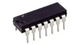{width=15%}

### Motor monofásico

Un motor monofásico es una máquina capaz de provocar una rotación en su eje al alimentarlo eléctricamente.

Este tipo de motores se suelen utilizar cuando no se dispone de una red trifásica a 380v generalmente usada en la industria y además se requiere de una baja potencia (de hasta 4 kW / 5 CV). El control que se va a realizar tiene que ser muy básico como un marcha-paro y cambio en el sentido de giro.

Este tipo de motores se pueden encontrar instalados en hormigoneras, amoladoras, mesas de trabajo, ventilación, bombas de agua, tornos, compresores de aire, sierras circulares, etc.

### Interruptor centrífugo

Un interruptor centrífugo es un interruptor eléctrico que funciona con la fuerza centrífuga creada desde un eje de rotación, lo más común es que sea de un motor eléctrico o de un motor de gasolina. El interruptor se diseña para activar o para desactivar en función de la velocidad rotatoria del eje.

## Materiales

| Componente       | Cantidad |
| ---              | ---      |
| CD4001           | 1        |
| MAC223           | 1        |
| Capacitor 104    | 1        |
| Capacitor 1uF    | 1        |
| Contactor        | 1        |
| Motor monofásico | 1        |
| MOC3011          | 2        |
| Push button      | 3        |
| Resistencia 100  | 1        |
| Resistencia 1K   | 2        |
| Resistencia 2.2K | 3        |
| Resistencia 220  | 1        |

## Esquemático

{width=50%}

Como se puede observar en la \cref{practica-05-diagrama}, este circuito de dos partes claramente delimitadas por los MOC3011, cumpliendo se debido funcionamiento ideal de separar, dentro de un mismo circuito, la parte de lógica / electrónica de la parte de potencia.

El conjunto de botones, resistencias de 2.2K y 4 CD4001 se encarga de dar la lógica del circuito. Cuando se presiona el botón de start, el motoro comienza a girar en un sentido, dependiendo de las conexiones iniciales al devanado de arranque.

Cuando se presiona el botón de cambio de dirección (para hacer esto, el circuito tiene que estar desactivado), se activa el contactor y cambia los contactos NC a NO y visceversa, logrando que la conexión del devanado de arranque cambie de sentido. Esto logra que, después de la activación del contactor, el motor gire para el lado contrario al inicial, debido al cambio de sentido de la corriente que transita por el devanado de arranque.

Por último, el botón de off se encarga de desactivar tanto el on como el cambio de dirección. Esto debido a que está conectado de tal manera que un solo botón desactiva el enclavado de ambos puntos.

## Resultados

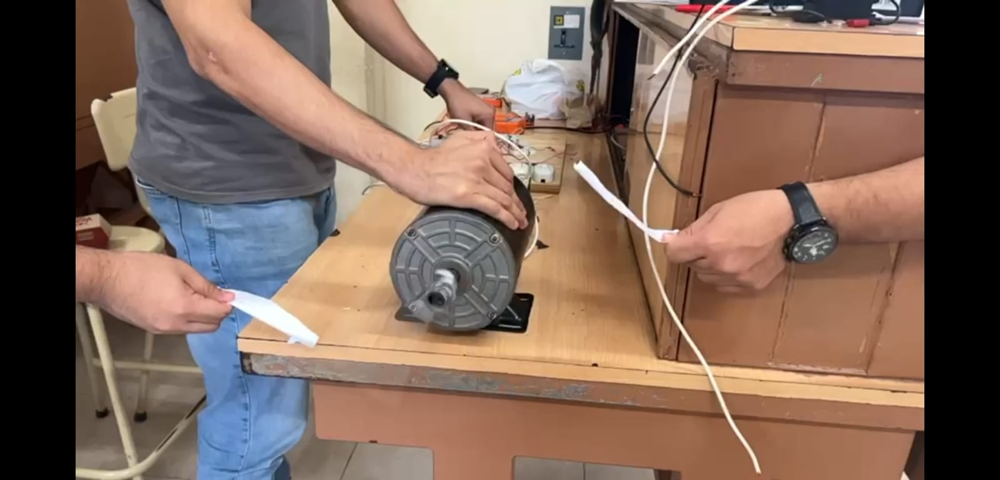

Como se puede observar en la \cref{practica-05-res-antihor}, el motor monofásico gira en sentido antihorario. Esto se logró simplemente presionando el botón de on, sin haber presionado el cambio de dirección. Esto quiere decir que el giro en este sentido es debido a la conexión que hicimos originalmente, ya que no es modificada por el contactor, ya que no está siendo activado.

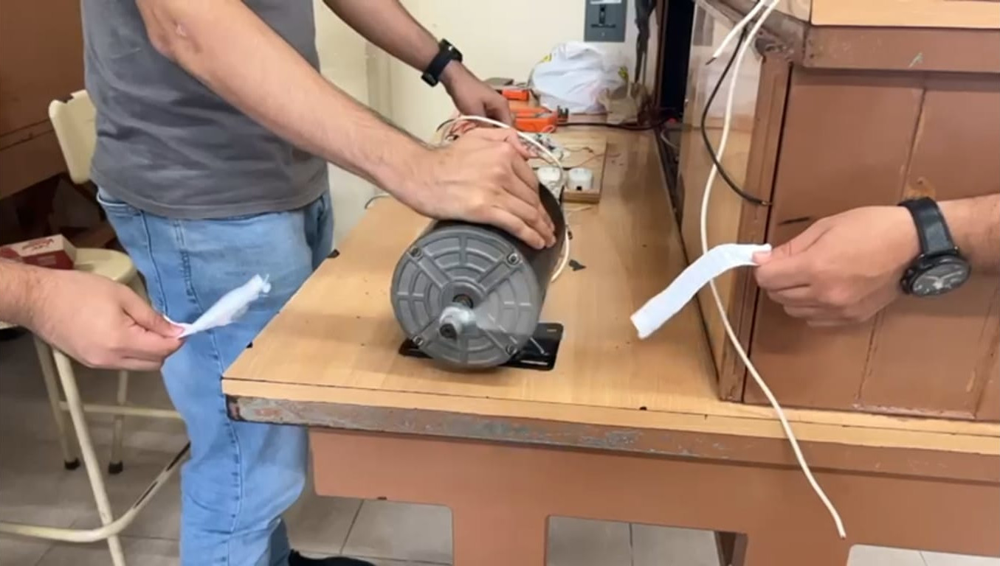

Por el otro lado, presionando primero el botón de cambio de dirección y, por ende, activando el contactor y cambiando el sentido del flujo de la corriente a través del devanado de arranque, para, seguidamente, presionar el botón de inicio, se puede observar que el motor monofásico ahora gira en sentido horario (ver \cref{practica-05-res-hor}), contrario al sentido de giro original.

El principal problema que se presentó, es que el circuito nunca se desactiva comletamente, siempre hay una pequeña corriente no deseada. Esto quiere decir que, a pesar de presionar el botón de off (desenclavamiento), el motor continúa girando en un sentido, pero más lento que cuando está activado. Esto es debido, principalmente, a la calidad de los componentes utilizados en el circuito, ya que se usaron componentes principalmente genéricos, por el precio. Si se utilizan componentes más especializados para esta tarea, este error desaparecerá.

\newpage
# Práctica 6: Chopper

## Introducción

Esta práctica trata sobre la utilización de un LM555 para generar una señal periódica de salida con una frecuencia variable, la cual se utiliza para controlar un transistor BD135 que, a su vez, forma parte de un arreglo denominado switch unidireccional. Con este circuito, es posible "cortar" la señal de entrada y poder controlar el brillo de un foco.

## Objetivo

- Implementación de un switch undireccional
- Control de brillo de un foco

## Marco teórico

### Switch unidireccional

El switch unidireccional es un arreglo de diodos en forma de puente de diodos, combinado con un transistor que permite controlar la salida del puente por medio de la oscilación del transistor. Esto quiere decir que permite que una entrada AC sinusoidal tenga una salida con la misma forma, pero reduciendo la potencia total por medio de "cortar" pedazos de la señal (ver \cref{funcionamiento-unidireccional}).

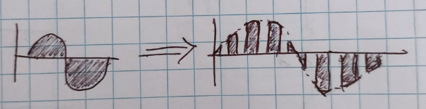{width=50%}

### 1N4007

El Diodo Rectificador 1N4007 (ver \cref{componente-1n4007}) fue inventado por John Ambrose Fleming fue un físico e ingeniero eléctrico británico realizo el descubrimiento en el año de 1904. Es considerado uno de los pioneros de la electrónica. La palabra diodo viene del vocablo  griego y se traduce como pasaje angosto. El término se ocupa en el área de la electricidad e electrónica. Es considerado un semiconductor debido a que solo permite la circulación de flujo de electrones en una única dirección con las singularidades similares a un interruptor.

Su funcionamiento consiste en permitir el flujo de energía eléctrica en un solo sentido, por lo cual se comporta de dos maneras:

- Polarización directa: permitiendo el paso de la corriente eléctrica.

- Polarización inversa: impidiendo el paso de la corriente eléctrica.

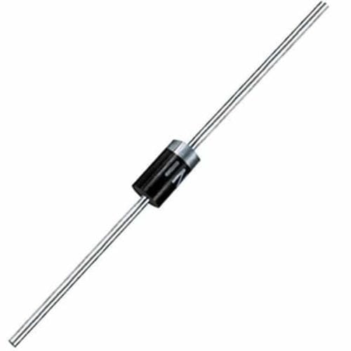{width=15%}

## Materiales

| Componente         | Cantidad |
| ---                | ---      |
| Resistencia 2.2K   | 1        |
| Potenciómetro 100K | 1        |
| LM555              | 1        |
| Capacitor 22uF     | 1        |
| Capacitor 103      | 2        |
| Resistencia 10K    | 1        |
| BD135              | 1        |
| Puente diodos      | 2        |
| LM7812             | 1        |
| Capacitor 470uF    | 1        |
| Foco               | 1        |

## Esquemático

{width=25%}

## Resultados

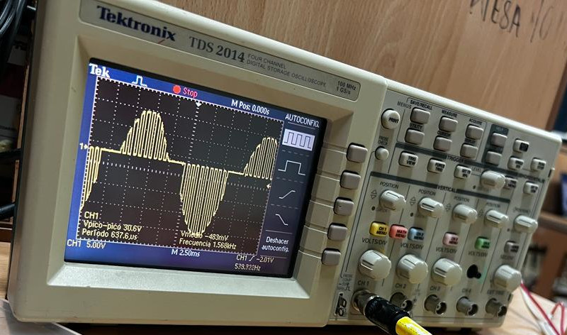{width=50%}

Como se puede observar en la \cref{resultado-pracatica-06}, el circuito funciona y corta de manera correcta la señal AC de entrada y la controla cuando genera la salida. Esto puede ser modificado mediante el ajuste del potenciómetro de 100K para poder regular la frecuencia de la señal de corte o, en otras palabras, el espacio entre los puntos energizados de la señal de salida.

\newpage
# Práctica 7: Arranque, Reversa y Paro con Motor de Lavadora

## Introducción

Con el fin de accionar un motor de lavadora y disponer de su máxima funcionalidad, recrear un circuito que accione al motor bajo accionamientos de arranque y paro.

## Objetivo

Desarrollar un circuito de corriente directa que disponga de tres botones que accionaran cambios en el sentido de giro del motor, ambos mediante enclavamientos que servirán como arranque, y uno exclusivo para detenerlo, el cual representa el botón de paro del circuito.

## Marco teórico

### encapsulado CD4013BE

El CD4013 Flip-Flop Dual es un circuito integrado MOS (CMOS) está formado de transistores así que los canales tipo N y tipo P están mejorados. En su interior cuenta con 2 Flip-Flop cada uno tiene sus datos independientes: set, reset, entradas de reloj y sus salidas Q y Q(negada).

### Compuerta lógica NOT

En lógica digital, un inversor, puerta NOT o compuerta NOT es una puerta lógica que implementa la negación lógica. Donde la tabla de verdad queda de la siguiente manera:

|     Entrada          |   Salida   |
|:--------------------:|:----------:|
|           0          |     1     |
|           1          |     0     |

la función de esta compuerta consiste en producir como salida el valor invertido de su entrada. El valor de salida de una compuerta NOT será 1 cuando su valor entrada sea 0 y será 0 cuando su valor de entrada sea 1.

### Compuerta lógica AND

La compuerta AND o puerta AND es una puerta lógica digital que implementa la conjunción lógica, esta tendrá una salida ALTA, únicamente cuando los valores de ambas entradas sean ALTOS. La tabla de verdad queda de la siguiente manera:

|     Entrada  A        |     Entrada  B        |   Salida   |
|:---------------------:|:---------------------:|:----------:|
|           0           |           0           |     0      |
|           0           |           1           |     0      |
|           1           |           0           |     0      |
|           1           |           1           |     1      |

La compuerta AND produce la multiplicación lógica AND, esto es: la salida es 1 si la entrada A y la entrada B están ambas en el binario 1: de otra manera, la salida es 0. Estas condiciones también son especificadas en la tabla de verdad para la compuerta AND.

## Materiales

|     Componente      | Cantidad |
|:-------------------:|:--------:|
| Cable cal. 22       | 2m       |
| Clavija con cable   | 1        |
| Botón de pulso      | 3        |
| CD4013BE            | 1        |
| 74LS04              | 1        |
| MOC                 | 2        |
| Triac               | 2        |
| Resistencias 220ohm | 1        |

## Esquemático

El circuito a recrear en la práctica es el siguiente:

-------------------- Esquemático de la práctica ----------------------

Es pertinente explicar los pines de cada compuerta lógica empleada en el circuito, por lo que se enlistan a continuación:

-------------------- 74ls04 ----------------------

Esta estructura para la compuerta NOT es la mayor empleada, comercialmente hablando, la cual el equipo incorporó en el circuito.

-------------------- CD4081 ----------------------

Esta compuerta tiene la particularidad que funciona en un rango de 12V, los cuales son requeridos en el circuito.

## Resultados

Al accionar el botón de arriba, el giro del motor es en un sentido horario en nuestro caso, cuando se pulsa el botón de enmedio se detiene el motor y a continuación se presiona el botón de abajo, el cual cambia el sentido de giro a antihorario, donde podemos concluir que el circuito funciona en óptimas condiciones. De igual manera, cabe aclarar que es indiferente si se presiona el botón de giro horario o antihorario de primero, el funcionamiento es el mismo.

{width=50%}

Las conexiones con la fuente de 12V DC y al motor se visualizan en las siguientes imagenes:

{width=50%}
{width=50%}

\newpage
# Práctica 8: Dimmer con Triac

## Introducción

Esta práctica consiste en hacer cambiar la luminosidad de un foco incandescente conectado a 120 V al variar el voltaje mediante un potenciómetro.

## Objetivo

- Aumentar o disminuir la luminosidad de un foco

## Marco teórico

### Diac

El DIAC (Diodo para Corriente Alterna) es un dispositivo semiconductor doble de dos conexiones. Es un diodo bidireccional autodisparable que conduce la corriente sólo tras haberse superado su tensión de disparo alternativa, y mientras la corriente circulante no sea inferior al valor triple de voltios característico para ese dispositivo. El comportamiento es variable para ambas direcciones de la corriente. La mayoría de los DIAC tienen una tensión de disparo doble variable de alrededor de 30 V. En este sentido, su comportamiento es similar a una lámpara de neón.

### Triac

El TRIAC es un componente electrónico semiconductor de tres terminales para controlar la corriente. Su nombre viene del término TRIode for Alternating Current = Triodo Para Corriente Alterna.
Un triac se utiliza para controlar una carga de CA (corriente alterna), semejante a como un transistor se puede utilizar para controlar una carga de CC (corriente continua).En definitiva, es un interruptor electrónico pero para corriente alterna.

### Potenciómetro

Un potenciómetro es un componente electrónico similar a los resistores pero cuyo valor de resistencia en vez de ser fijo es variable, permitiendo controlar la intensidad de corriente a lo largo de un circuito conectándolo en paralelo ó la caida de tensión al conectarlo en serie. Un potenciómetro es un elemento muy similar a un reostato , la diferencia es que este último disipa más potencia y es utilizado para circuitos de mayor corriente, debido a esta carácterística, por lo general los potenciómetros son generalmente usados para variar el voltaje en un circuito colocados en paralelo, mientras que los reostatos se utilizan en serie para variar la corriente .

## Materiales

|     Componente          | Cantidad |
|:-----------------------:|:--------:|
|Clavija con cable        |1         |
|ITM                      |1         |
|Resisetncia 100 Ohms     |1         |
|Potenciómetro 100 K      |1         |
|Resistencia 47K          |1         |
|Resistencia 2.2K         |1         |
|Diac                     |1         |
|MAC 224                  |1         |
|Foco incandescente       |1         |
|Capacitor 104            |3         |

## Esquemático

## Resultados

\newpage
# Práctica 9: Dimmer Doble con SCR

## Introducción
La presente práctica consiste en recortar los valles positivos o negativos, según sea el caso, de una señal sinusoidal usando dos dispositivos SCR y regulados por un potenciómetro. Al recortar dicha señal se podrá observar que sube o baja la intensidad de un foco incandescente.

## Objetivo

- Variar la energía que recibe un foco incandescente y a su vez regular su intensidad de luz, utilizando un dimmer con doble SCR

## Marco teórico

### Dimmer
Un dimmer, regulador, atenuador o dímer, sirve para regular la energía en uno o varios focos con el fin de variar la intensidad de la luz que emiten, cuando las propiedades de la lámpara lo hacen posible.

### SCR (Rectificador controlado de silicio)
El rectificador controlado de silicio es un tipo de tiristor formado por cuatro capas de material semiconductor con estructura PNPN o bien NPNP.

## Materiales

|     Componente            | Cantidad |
|:-----------------------:  |:--------:|
|Switch cola de rata        |1         |
|Foco 12 V                  |1         |
|SCR Tic126                 |2         |
|Potenciómetro 50Kohm       |2         |
|Resistencia 100 Ohms       |2         |
|Cap. Electr. 47uF          |1         |
|TResistencia 10k           |1         |
|Diodo in4007               |2         |
|Transformador 12V          |1         |

## Esquemático

## Resultados

\newpage
# Práctica 10: Flyback

## Introducción

Con el fin de poder apreciar una estela debido a una consecuencia directa de alta tensión, generar un circuito el cual alimente un flyback con el fin de apreciar una estela que sea directamente proporcional a la tensión eléctrica presente en el circuito.

## Objetivo

Mediante un circuito analizado en clases, conectar un dispositivo flyback con el fin de generar una estela de voltaje visible a la vista humana.

## Marco teórico

### Transformador flyback

Un transformador flyback o transformador de líneas es un tipo de transformador que genera una alta tensión necesaria para hacer funcionar un tubo de rayos catódicos (CRT).

Este transformador de líneas o flyback incorpora un circuito rectificador en su interior formado en su parte de alta tensión por varios devanados, que incorporan diodos en serie internos y utilizan la capacidad parásita que hay entre ellos para filtrar y estabilizar la corriente rectificada por los diodos. La corriente consumida por el tubo en alta tensión es mínima, por lo que estas capacidades parásitas son suficientes.

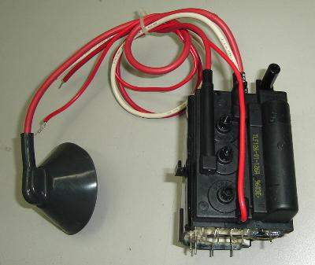{width=50%}

## Materiales

|     Componente            | Cantidad |
|:-----------------------:  |:--------:|
|Fuente de voltaje variable |1         |
|Capacitor cerámico 103     |1         |
|Capacitor cerámico 22 uF   |1         |
|Potenciómetro 50Kohm       |1         |
|Resistencia 2.2K           |1         |
|Transistor TIP3055         |1         |
|Transistor Flyback         |1         |
|Caimanes                   |2         |
|Cinta aislante             |1         |

## Esquemático

En la siguientes ilustraciones, se pueden apreciar lo que son el esquemático del circuito para el flyback y de una fuente con salida de 12V.

------------------ Modelo de CIAU ------------------

Por alguna cuestion de diseño, el esquemático de la fuente quedó descartado y en su lugar se emplea una fuente de voltaje variable para métodos prácticos del circuito.

## Resultados

El circuito fue conectado al flyback y se obtuvieron las siguientes conexiones:

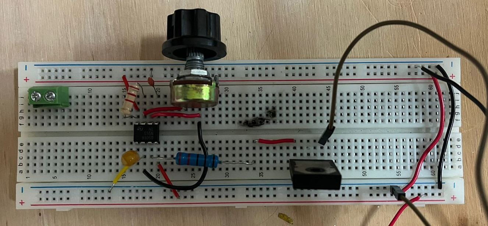{width=50%}

{width=50%}

Mediante la prueba en físico de la práctica, se apreció que la mayor distancia que el flyback permitió para obtener la estela fue de 1 cm aproximadamente de separación entre las puntas, de manera que la práctica fue realizada con éxito. Es importante recalcar que para fines prácticos, el potenciómetro se accionó con la máxima resistencia posible, la cual es de 50kohm, lo cual afectaba en la frecuencia del transistor.

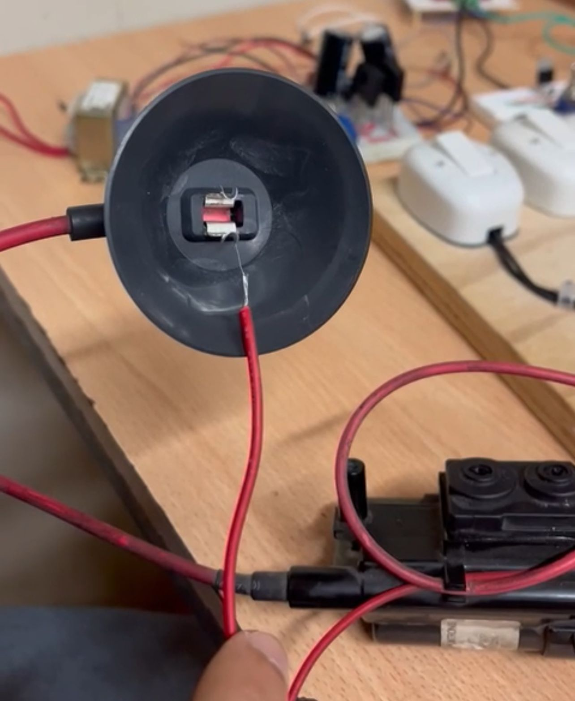{width=50%}

\newpage
# Referencias (actualizar)

- https://www.solerpalau.com/es-es/blog/motor-monofasico/

- https://www.zuendo.com/smartblog/38_motor-electrico-y-funciones.html

- https://www.logicbus.com.mx/compuertas-logicas.php

- https://es.wikipedia.org/wiki/Diac

- https://www.etsist.upm.es/estaticos/ingeniatic/index.php/tecnologias/item/556-potenciómmetro%3Ftmpl=component&print=1.html

- https://es.wikipedia.org/wiki/Rectificador_controlado_de_silicio
