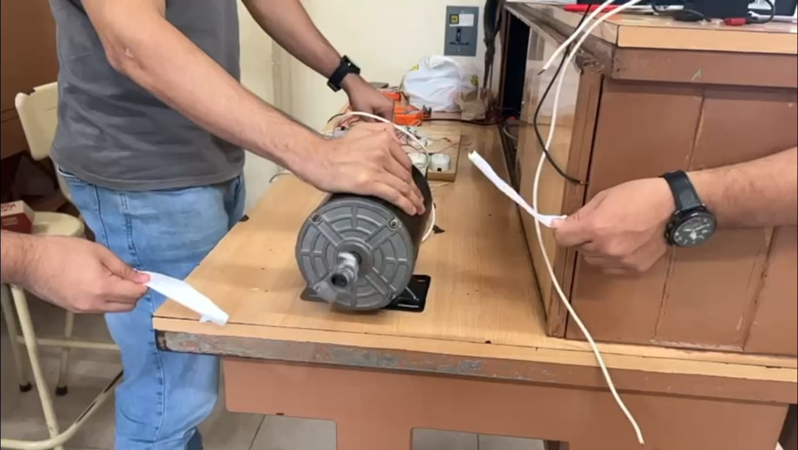

\newpage
# LED AC Rectificador

## Introducción

Mediante tres diferentes arreglos de circuitos, se encenderá un LED mediante una fuente de tipo alterna desde una clavija a la toma de corrientes de 120v. A continuación, se presentará el procedimiento y resultados de la práctica.

## Objetivo

- Encender un LED mediante corriente alterna.

## Marco teórico

### Diodos

El diodo es un dispositivo tipo semiconductor que permite el paso de la corriente eléctrica en un sentido cuando se le administra un voltaje suficiente para dejar que fluya la corriente, e impide su paso a través del otro sentido, el cual usualmente se aplica para rectificar el flujo de la corriente por sus características. Es un componente básico de los circuitos electrónicos que esta muy presente en dispositivos modernos, tales como ordenadores, equipos de audio, televisores, teléfonos, entre otras cosas. De igual manera, su principal aplicación, ya antes mencionado, es como rectificador, ya que permite el cambio de corriente alterna a directa mediante un arreglo conocido como puente de diodos, debido a que cuentan con polaridad, donde estan presentes el cátodo (terminal negativa) y el ánodo (terminal positiva). Los diodos se clasifican según su tipo, tensión y capacidad de corriente.

Imagen de un diodo (pendiente)

Cuando un diodo permite un flujo de corriente, tiene polarización directa. Cuando un diodo tienen polarización inversa, actúa como un aislante y no permite que fluya la corriente.

Imagen del funcionamiento de un diodo.

### Diodo emisor de luz (LED)

Existen varios tipos de diodos con diferentes aplicaciones y utilidades según su configuración y estructura, uno de éstos es el diodo tipo LED, los cuales funcionan en polarización directa, y se caracterizan porque las recombinaciones de los portadores de carga generan fotones, las particulas elementales que forman la luz. Dentro de estos hay de varios tipos, como los DIP (Dual In-Line Package) LED, que son las luces LED tradicionales y en las que piensa la mayoría de la gente cuando se les pide.

### Voltaje 127 AC
Existen múltiples formas de alimentación eléctrica, la más utilizada de manera cotidiana es mediante el voltaje de 127 volts con el que la mayoría contamos en nuestros hogares. Este voltaje se conoce como voltaje nominal y está regulado por el "Reglamento de la Ley del Servicio Público de Energía Eléctrica". Durante esta práctica se utilizará dicho voltaje como forma de alimentación del circuito que se utilizará para analizar el comportamiento de la corriente en dos situaciones.

### Resistencia
Estos componentes están hechos de carbón u otros materiales que se oponen al flujo de corriente, lo cual genera una característica eléctrica llamada "resistencia". Esta característica se define como la oposición al flujo de electrones a través de un conductor.

### Rectificador de media onda
De manera general es un circuito simple empleado para eliminar la mitad de una onda, ya sea la parte positiva o la negativa. Para realizar uno de estos rectificadores basta con colocar un diodo en el circuito. También existen los rectificadores de onda completa cuya construcción es ligeramente más compleja, donde se requieren 4 diodos en un arreglo específico.

## Materiales
A continuación se presenta la lista de los componentes utilizados en ambos casos de la práctica:

|     Componente    | Cantidad |
|:-----------------:|:--------:|
| Cable cal. 22     | 2m       |
| Clavija con cable | 1        |
| LED               | 1        |
| Diodo 1N4007      | 1        |
| Resistencia 30K   | 1        |
## Esquemático

## Resultados y Conclusiones

\newpage

# SCR

## Introducción

## Objetivo

## Marco teórico

## Materiales

## Esquemático

## Resultados

\newpage
# On Delay 120V

## Introducción

Esta práctica trata sobre la utilización de un LM555 para poder crear un timer on delay con un valor de retardo de 10 segundos para, seguidamente, probar su funcionalidad en un circuito más grande con un foco como información visual.

## Objetivo

- Creación de un timer on delay que pueda funcionar con 120V AC.
- Utilizar el timer on delay previamente creado como un módulo en un circuito combinado con un enclavamiento para mantener encendido un foco.

## Marco teórico

### LM555

El circuito integrado 555 es un temporizador eléctrico y se le conoce como “máquina del tiempo” por la gran variedad de tareas que puede realizar con respecto al tiempo. El LM555 tiene internamente una combinación de circuitos digitales y analógicos, se utiliza comúnmente para proporcionar retardos de tiempo, como oscilador a una determinada frecuencia, y como un circuito integrado flip-flop.

Los empaquetados de los circuitos integrados se pueden identificar por una o varias letras como D, DB, JG, P o PW el cual es el más común para experimentación y tiene 8 pines en total (\cref{conexiones-lm555}).

{width=25%}

1. **GND:** Corresponde a la terminal negativa de la alimentación, generalmente tierra.

2. **Disparo(TRIG):** Es la parte del circuito integrado donde se establece el inicio del tiempo de retardo para la configuración monoestable del LM555. Para que ocurra este proceso el pulso disparador disminuye el voltaje (1/3)Vcc, donde Vcc corresponde al voltaje de alimentación.

3. **Salida(OUT):** En este pin se puede observar el resultado de la configuración del temporizador eléctrico ya sea como monoestable, estable u otra opción.

4. **Reinicio(RESET):** Para un nivel de voltaje por debajo de 0.7 V, tiene la función de poner el pin de salida a nivel bajo. Para evitar el reinicio se deberá conectar este pin a alimentación.

5. **Control de voltaje(CTRL o CONT):** Al utilizar el circuito integrado LM555 como controlador de voltaje, el voltaje en esta terminal puede variar teóricamente desde Vcc hasta aproximadamente 0 V, en la práctica la variación es de Vcc – 1.7 V hasta casi 2 V menos.

6. **Umbral(THR o THRES):** Corresponde a la entrada de un comparador interno de umbral el cual se emplea para poner la señal de salida a un nivel bajo.

7. **Descarga(DIS o DISCH):** Permite descargar el condensador externo al circuito integrado 555 para su funcionamiento.

8. **Voltaje de alimentación(Vcc o Vdd):** Terminal positiva de la alimentación, normalmente son valores de 4.5 V hasta 16 V.

### Timer on delay

Como su nombre lo indica, el timer on delay no genera una salida hasta que transcurre un tiempo predefinido:

{width=50%}

Como se puede observar en la \cref{funcionamiento-on-delay}, cuando se energiza el timer, este no genera una salida alta hasta que pasa, en el caso de este ejemplo, un periodo de tiempo de 10 segundos. Este tiempo es el que puede ser modificado, dependiendo de la aplicación que se le de.

## Materiales

- 1 BC337
- 1 LM555
- 1 contactor
- 1 foco
- 1 relay 12V
- 1 switch nc
- 1 switch no
- Capacitores 103
- Resistencias 10K
- Resistencias 2.2K

## Esquemático

{width=25%}

{width=25%}

{width=25%}

## Resultados

En el inciso a, se logró utilizar el LM555 en su modo monoestable. Esto quiere decir que, combinado con un push button, se logró simular el funcionamiento de un on delay, a pesar de que, en realidad, no lo sea por definición.

En el inciso b, se utiliza el LM555 en el modo de retardo de tiempo, específicamente, después de ser energizado, con un valor de 10 segundos. Esto quiere decir que se logra crear un timer on delay con un valor de retardo a la entrada de 10 segundos. Después de probarlo, se obtienen resultados satisfactorios.

En el inciso c, ya con el timer on delay armado del punto anterior, se utiliza como un módulo para un circuito más grande. Este nuevo circuit cuenta con el timer y un contactor, conectado de manera que se tenga un enclavamiento. Esto logra que, una vez pasado el tiempo de retardo del timer, el foco se activa y, al mismo tiempo, se activa el enclavamiento, manteniendo encendido el foco, siempre y cuando no se desenclave por medio del butón normalmente cerrado.

\newpage
# Enclavamiento Electromagnético

## Introducción

## Objetivo

## Marco teórico

## Materiales

## Esquemático

## Resultados

\newpage
# Arranque, Reversa y Paro con Motor Monofásico

## Introducción

Esta práctica consta de la combinación de dos partes: primero, se tiene un circuito de lógica, conformado por el CD4001, que se encarga de controlar el inicio, paro y sentido de giro del motor monofásico, en combinación con un arreglo que permite enclavar la señar.

Seguidamente, este circuito se conecta a uno de potencia, que utiliza la lógica anterior junto con un contactor para poder cambiar el sentido de dirección del motor, dependiendo de los botones que hayan sido presionados con anterioridad.

## Objetivo

- Implementación de un arranque y paro, con enclavamiento, por medio de compuertas NOR
- Utilización del arraqnue y paro junto con un un circuito de potencia para controler el sentido del giro de un motor monofásico

## Marco teórico

### MAC223

El triac es un dispositivo semiconductor de tres terminales que se usa para controlar el flujo de corriente promedio a una carga, con la particularidad de que conduce en ambos sentidos y puede ser bloqueado por inversión de la tensión o al disminuir la corriente por debajo del valor de mantenimiento. El triac puede ser disparado independientemente de la polarización de puerta, es decir, mediante una corriente de puerta positiva o negativa.

Cuando el triac conduce, hay una trayectoria de flujo de corriente de muy baja resistencia de una terminal a la otra, dependiendo la dirección de flujo de la polaridad del voltaje externo aplicado.

El MAC223A8 (\cref{mac223}) es un TRIAC estándar de 25 A diseñado para aplicaciones de conmutación de CA y control de fase. Este normalmente funciona en los cuadrantes I y III activados desde la línea de CA.

{width=15%}

### MOC3011

Este (\cref{moc3011}) consta de un diodo emisor de infrarrojos de arseniuro de galio, acoplado ópticamente a un interruptor bilateral de silicio y está diseñado para aplicaciones que requieren disparo aislado de TRIAC,  bajo corriente de conmutación aislado de CA, un alto aislamiento eléctrico (a 7500V pico), de alto voltaje detector de punto muerto, pequeña tamaño, y de bajo costo.

Un opto acoplador, también llamado optoaislador o aislador acoplado ópticamente, es un dispositivo de emisión y recepción que funciona como un interruptor activado mediante la luz emitida por un diodo LED que satura un componente opto electrónico, normalmente en forma de fototransistor o fototriac. De este modo se combinan en un solo dispositivo semiconductor, un foto emisor y un foto receptora cuya conexión entre ambos es óptica. Estos elementos se encuentran dentro de un encapsulado que por lo general es del tipo DIP. Se suelen utilizar para aislar eléctricamente a dispositivos muy sensibles.

{width=15%}

### CD4001

Es un circuito integrado que consta de cuatro compuertas NOR de dos entradas (\cref{cd4001}). La puerta NOR o compuerta NOR es una puerta lógica digital que implementa la disyunción lógica negada, se comporta de acuerdo a la tabla de verdad. Cuando todas sus entradas están en 0 (cero) o en BAJA, su salida está en 1 o en ALTA, mientras que cuando una sola de sus entradas o ambas están en 1 o en ALTA, su SALIDA va a estar en 0 o en BAJA. NOR es el resultado de la negación del operador OR. También puede ser visto como una puerta AND con todas las entradas invertidas. El NOR es una operación completamente funcional. Las puertas NOR se pueden combinar para generar cualquier otra función lógica. En cambio, el operador OR es monótono, ya que solo se puede cambiar BAJA a ALTA, pero no viceversa.

El semiconductor complementario de óxido metálico o complementary metal-oxide-semiconductor (CMOS) es una de las familias lógicas empleadas en la fabricación de circuitos integrados. Su principal característica consiste en la utilización conjunta de transistores de tipo pMOS y tipo nMOS configurados de forma tal que, en estado de reposo, el consumo de energía es únicamente el debido a las corrientes parásitas, colocado en la placa base.

{width=15%}

## Materiales

- 1 CD4001
- 1 MAC223
- 1 capacitor 104
- 1 capacitor 1uF
- 1 contactor
- 1 motor monofásico
- 2 MOC3011
- 3 push buttons normalmente abiertos
- Resistencias 100
- Resistencias 1K
- Resistencias 2.2K
- Resistencias 220

## Esquemático

{width=50%}

Como se puede observar en la \cref{practica-05-diagrama}, este circuito de dos partes claramente delimitadas por los MOC3011, cumpliendo se debido funcionamiento ideal de separar, dentro de un mismo circuito, la parte de lógica / electrónica de la parte de potencia.

El conjunto de botones, resistencias de 2.2K y 4 CD4001 se encarga de dar la lógica del circuito. Cuando se presiona el botón de start, el motoro comienza a girar en un sentido, dependiendo de las conexiones iniciales al devanado de arranque.

Cuando se presiona el botón de cambio de dirección (para hacer esto, el circuito tiene que estar desactivado), se activa el contactor y cambia los contactos NC a NO y visceversa, logrando que la conexión del devanado de arranque cambie de sentido. Esto logra que, después de la activación del contactor, el motor gire para el lado contrario al inicial, debido al cambio de sentido de la corriente que transita por el devanado de arranque.

Por último, el botón de off se encarga de desactivar tanto el on como el cambio de dirección. Esto debido a que está conectado de tal manera que un solo botón desactiva el enclavado de ambos puntos.

## Resultados

Como se puede observar en la \cref{practica-05-res-antihor}, el motor monofásico gira en sentido antihorario. Esto se logró simplemente presionando el botón de on, sin haber presionado el cambio de dirección. Esto quiere decir que el giro en este sentido es debido a la conexión que hicimos originalmente, ya que no es modificada por el contactor, ya que no está siendo activado.

Por el otro lado, presionando primero el botón de cambio de dirección y, por ende, activando el contactor y cambiando el sentido del flujo de la corriente a través del devanado de arranque, para, seguidamente, presionar el botón de inicio, se puede observar que el motor monofásico ahora gira en sentido horario (ver \cref{practica-05-res-hor}), contrario al sentido de giro original.

El principal problema que se presentó, es que el circuito nunca se desactiva comletamente, siempre hay una pequeña corriente no deseada. Esto quiere decir que, a pesar de presionar el botón de off (desenclavamiento), el motor continúa girando en un sentido, pero más lento que cuando está activado. Esto es debido, principalmente, a la calidad de los componentes utilizados en el circuito, ya que se usaron componentes principalmente genéricos, por el precio. Si se utilizan componentes más especializados para esta tarea, este error desaparecerá.

\newpage
# Chopper

## Introducción

## Objetivo

## Marco teórico

## Materiales

## Esquemático

## Resultados

\newpage
# Arranque, Reversa y Paro con Motor de Lavadora

## Introducción

## Objetivo

## Marco teórico

## Materiales

## Esquemático

## Resultados

\newpage
# Dimmer con Triac

## Introducción

## Objetivo

## Marco teórico

## Materiales

## Esquemático

## Resultados

\newpage
# Dimmer Doble con SCR

## Introducción

## Objetivo

## Marco teórico

## Materiales

## Esquemático

## Resultados

\newpage
# Flyback

## Introducción

## Objetivo

## Marco teórico

## Materiales

## Esquemático

## Resultados

